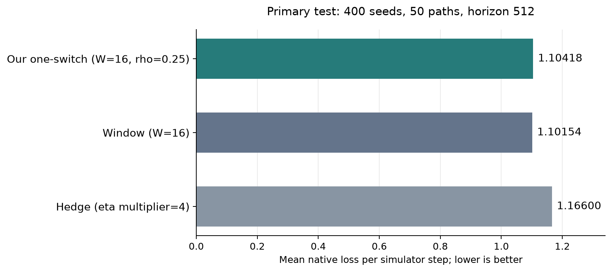

[English](README.md) | [Русский](README.ru.md)

# CAGE 2: selected one-switch and primary references

Our one-switch with a scalar-aware oracle (W=16, rho=0.25) has 5.30% lower mean loss than tuned Hedge and 0.24% higher mean loss than tuned window. Both findings are supported by the predeclared simultaneous intervals. This experiment establishes neither superiority over window nor statistical equivalence.

The metric is the sum of four native loss components per simulator step: host compromise, server compromise, operational disruption, and restore cost. Lower is better.

## Primary test

All three configurations were selected on separate data and locked before final outcomes were read. Validation uses 100 simulator seeds and 20 common paths. The final test uses 400 new seeds and all 50 predeclared new paths at horizon 512. The two banks contain 9000 new 50-step episodes. Every pair of six defenses and three attack modes is evaluated on every simulator seed.

| Method | Mean loss |
|---|---:|
| Our one-switch (W=16, rho=0.25) | 1.10418 |
| Window (W=16) | 1.10154 |
| Hedge (eta multiplier=4) | 1.16600 |

| Our method minus reference | Difference | Simultaneous interval | Finding |
|---|---:|---:|---|
| Window (W=16) | +0.00265 | [+0.00254, +0.00275] | Our method has higher loss |
| Hedge (eta multiplier=4) | -0.06182 | [-0.08010, -0.04421] | Our method has lower loss |

The intervals are approximate: 10,000 paired crossed bootstrap draws with simultaneous family level 95% for two comparisons (Bonferroni correction). Whole simulator-seed tables and whole common paths are resampled, preserving dependence within them. Inference is conditional on the original calibration and locked configurations; calibration and selection uncertainty are excluded.



The mean-loss chart starts at zero. Uncertainty of the predeclared differences is shown separately below.


## Why performance is close to window

In all 50 final paths, our method and window take exactly the same actions from round 2. Both use a forecast from the last 16 already disclosed attack modes and the same trained loss table. Our method additionally enforces the oracle admissibility condition; it does not alter subsequent actions on these data.

The loss difference is entirely due to our algorithm's first uniform action. Window immediately responds to the known initial mode. Changing the first action was outside the locked tuning plan; neither the parameters nor this action were changed after test inspection. The action-equality diagnostic is descriptive and was performed after configuration selection.

## Implementation and limits

The implementation is continuous one-switch without restarts: forecast window W=16 and permitted gap fraction rho=0.25. Window is also selected with W=16; Hedge uses learning-rate multiplier 4. The full selection grid is retained. The primary test has no safe switches, scalar-oracle fallbacks, or nominal oracle-contract violations. Numerical residual checks provide numerical evidence rather than an exact-arithmetic certificate.

This is a simulator experiment with a known training model and attack-mode disclosure after defense selection. Mixtures represent expected outcomes of whole independently reset episodes. The attacker selects among three frozen modes and learns no new tactics. The primary statistical comparisons concern scalar loss. Geometric error was not computed in the original primary analysis; supplementary numerical checks of the calibrated game are presented separately. Scalar loss close to window does not by itself demonstrate the practical benefit of the paper's vector guarantee. These results do not establish general superiority over other CAGE methods or on a live network.

## Reproducibility and archive

This is a focused presentation of an already completed study, created after its outcomes were inspected. The primary test, all 50 paths, configurations, and both predeclared comparisons are preserved. Exploratory restart checks and untuned variants remain available in the full archive.

[Full study archive](https://github.com/Jew-Yeah/aamas-lowdim-experiments/tree/e8c85cb2e7be49032c1c2d014b6f19084ea064a8/results/cage_adaptation) · `archive/full-study-2026-10-04` (branch)

The retained primary NPZ contains all six originally evaluated methods as provenance data. This report and its plots display only the three validation-selected methods. `analysis.json` explicitly records this projection and the full source-analysis SHA-256; the original NPZ, protocol, and selection are not replaced.

[Methodology](../../docs/cage_adaptation_en.md)

[Protocol](protocol.json) · [Locked selection](selection.json) · [Selection checksum](selection.sha256.json) · [Full validation grid](validation_grid.json) · [Primary analysis](analysis.json) · [Action diagnostic](trace_diagnostics.json) · [Aggregate inputs](groups/) · [Episode banks](../../data/cage2_adaptation/) · [Artifact checksums](SHA256SUMS.json)

To regenerate this report from published aggregates without running the simulator:

```powershell
python scripts/build_cage_adaptation_report.py --run-dir results/cage_adaptation --bank-root data/cage2_adaptation --output results/runs/focused_report
```

PDF figures: [means](primary_means.pdf), [differences and intervals](primary_comparisons.pdf).

## Supplementary figures

[Figure gallery and PDFs](figures/README.md): loss dynamics, cumulative differences, four components, path variability, validation sensitivity, and numerical distance to the full vector target.

These checks are descriptive and were added after the primary test. The locked parameters and two original statistical comparisons are preserved.

## AAMAS paper materials

[English publication figures](aamas/README.md) include cumulative cost differences, primary contrasts with components, and vector geometry. [The LaTeX section](../../paper/README.md) recommends a table and cumulative comparison for main text. [Submission guidance](../../docs/aamas_submission_en.md) documents AAMAS 2027 formatting and the anonymous package.
