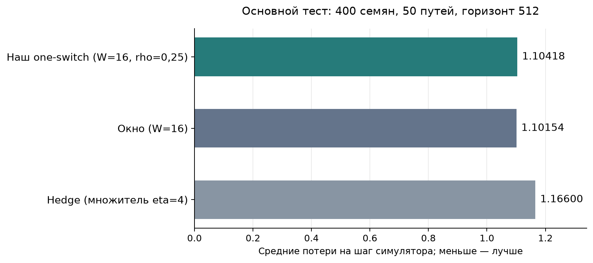
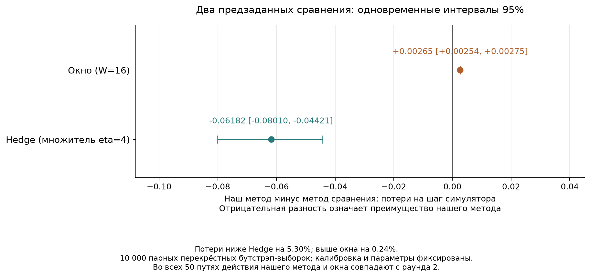

[English](README.md) | [Русский](README.ru.md)

# CAGE 2: выбранный one-switch и основные методы сравнения

Наш one-switch с оракулом, учитывающим скалярные потери (W=16, rho=0,25), даёт на 5.30% меньшие средние потери, чем настроенный Hedge. От настроенного окна он отстаёт на 0.24%. Оба вывода поддерживаются предзаданными одновременными интервалами. В этом эксперименте превосходство над окном и статистическая эквивалентность не установлены.

Метрика — сумма четырёх нативных потерь на шаг симулятора: компрометация хостов, компрометация сервера, нарушение работы и восстановление. Меньше означает лучше.

## Основной тест

Параметры всех трёх методов выбраны на отдельных данных и зафиксированы до чтения финальных результатов. Валидация: 100 семян симулятора и 20 общих путей. Финальный тест: 400 новых семян и все 50 предзаданных новых путей, горизонт 512. Для двух банков собрано 9000 новых 50-шаговых эпизодов. Каждая пара из шести защит и трёх режимов атаки оценена на каждом семени.

| Метод | Средние потери |
|---|---:|
| Наш one-switch (W=16, rho=0,25) | 1.10418 |
| Окно (W=16) | 1.10154 |
| Hedge (множитель eta=4) | 1.16600 |

| Наш метод минус метод сравнения | Разность | Одновременный интервал | Вывод |
|---|---:|---:|---|
| Окно (W=16) | +0.00265 | [+0.00254, +0.00275] | Наш метод хуже |
| Hedge (множитель eta=4) | -0.06182 | [-0.08010, -0.04421] | Наш метод лучше |

Интервалы приближённые: 10 000 парных перекрёстных бутстрэп-выборок с семейным уровнем 95% для двух сравнений (поправка Бонферрони). Перевыбираются целиком таблицы семян симулятора и целиком общие пути, сохраняя зависимость внутри них. Вывод условен на исходной калибровке и зафиксированных параметрах; неопределённость их выбора и обучения не включена.



График средних начинается с нуля. Неопределённость предзаданных разностей показана отдельно ниже.



## Почему результат близок к окну

Во всех 50 финальных путях действия нашего метода и окна в точности совпадают со второго раунда. Оба используют прогноз по последним 16 уже раскрытым режимам атаки и одну обученную таблицу потерь. Наш метод дополнительно соблюдает условие допустимости оракула; на этих данных оно не меняет последующие действия.

Разность потерь целиком объясняется первым равномерным ходом нашего алгоритма. Окно сразу отвечает на известный начальный режим. Изменение первого хода не входило в зафиксированную настройку; параметры и ход не изменялись после просмотра теста. Диагностика совпадения действий описательная и выполнена после выбора параметров.

## Реализация и границы вывода

Используется непрерывный one-switch без перезапусков: прогнозное окно W=16, доля допустимого зазора rho=0,25. Окно также выбрано с W=16; Hedge — с множителем скорости обучения 4. Полная сетка выбора сохранена. В основном тесте не было безопасных переключений, возвратов к исходному оракулу или превышений номинального допуска оракула. Численная проверка остатка служит численным свидетельством, а не сертификатом в точной арифметике.

Это эксперимент в симуляторе с известной обучающей моделью и раскрытием режима атаки после выбора защиты. Смеси обозначают ожидаемые исходы полных независимо инициализированных эпизодов. Противник выбирает среди трёх зафиксированных режимов; новые тактики не изучает. Основные статистические сравнения относятся к скалярным потерям. Геометрическая ошибка в исходном основном анализе не вычислялась; дополнительные численные проверки калиброванной игры представлены отдельно. Близость скалярных потерь к окну сама по себе не демонстрирует практическую пользу векторной гарантии статьи. Результат не означает общего превосходства над другими методами CAGE или на живой сети.

## Воспроизводимость и архив

Это сокращённое представление уже завершённого исследования, созданное после просмотра его результатов. Состав основного теста, все 50 путей, параметры и два предзаданных сравнения сохранены. Побочные проверки перезапусков и ненастроенных вариантов доступны в полном архиве.

[Полный архив исследования](https://github.com/Jew-Yeah/aamas-lowdim-experiments/tree/e8c85cb2e7be49032c1c2d014b6f19084ea064a8/results/cage_adaptation) · `archive/full-study-2026-10-04` (ветка)

Сохранённый основной NPZ содержит все шесть первоначально оценённых методов как данные происхождения. Отчёт и графики показывают только три метода, выбранных на валидации. `analysis.json` явно записывает это сокращение и SHA-256 полного исходного анализа; исходные NPZ, protocol и selection не подменяются.

[Методика](../../docs/cage_adaptation_ru.md)

[Protocol](protocol.json) · [Locked selection](selection.json) · [Selection checksum](selection.sha256.json) · [Full validation grid](validation_grid.json) · [Primary analysis](analysis.json) · [Action diagnostic](trace_diagnostics.json) · [Aggregate inputs](groups/) · [Episode banks](../../data/cage2_adaptation/) · [Artifact checksums](SHA256SUMS.json)

Для пересоздания этого отчёта из опубликованных агрегатов без запуска симулятора:

```powershell
python scripts/build_cage_adaptation_report.py --run-dir results/cage_adaptation --bank-root data/cage2_adaptation --output results/runs/focused_report
```

PDF для статьи: [средние](primary_means.ru.pdf), [разности и интервалы](primary_comparisons.ru.pdf).

## Дополнительные графики

[Галерея графиков и PDF](figures/README.ru.md): динамика потерь, накопленная разность, четыре компоненты, разброс по траекториям, валидационная чувствительность и численная ошибка до полного векторного целевого множества.

Эти проверки описательные и добавлены после завершения основного теста. Параметры и два исходных статистических сравнения сохранены.

## Материалы AAMAS

[Английские графики для статьи](aamas/README.ru.md) содержат накопленную разницу потерь, основные сравнения с компонентами и векторную геометрию. [Раздел LaTeX](../../paper/README.ru.md) предлагает таблицу и накопленную разность для основного текста. [Требования к подаче](../../docs/aamas_submission_ru.md) описывают формат AAMAS 2027 и анонимный пакет.
