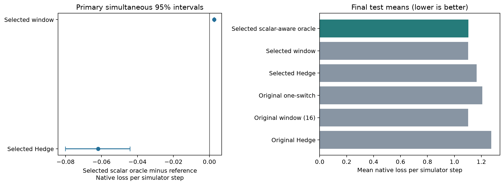
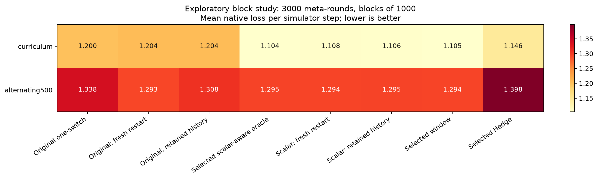
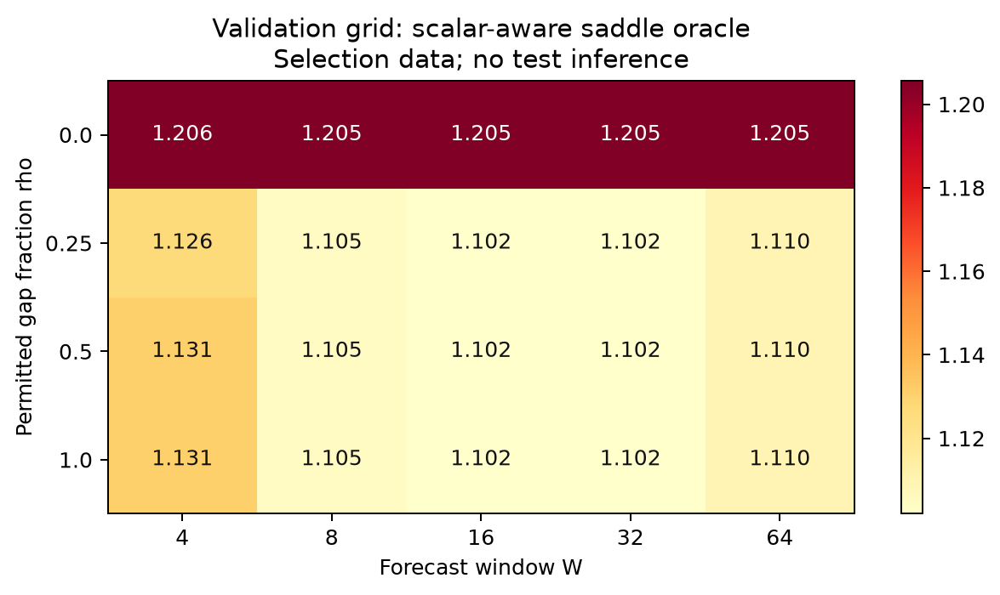

[English](README.md) | [Русский](README.ru.md)

# Настройка оракула и перезапуски CAGE 2

Результаты новой проверки после настройки на отдельной валидации. Исходная статья и прежние результаты сохранены. Метрика — сумма четырёх нативных потерь на шаг симулятора; меньше означает лучше.

Параметры выбраны до чтения финальных результатов. Валидация: 100 семян и 20 общих путей. Финальный тест: 400 новых семян и 50 новых путей при горизонте 512. Всего собраны 9000 новых 50-шаговых эпизодов.

## Выбранные параметры

- scalar: {"family": "scalar", "grid_index": 9, "kind": "scalar", "name": "scalar_w16_r0p25", "rho": 0.25, "window": 16}
- window: {"family": "window", "grid_index": 22, "kind": "window", "name": "window_w16", "window": 16}
- hedge: {"eta_multiplier": 4, "family": "hedge", "grid_index": 29, "kind": "hedge", "name": "hedge_eta4"}

## Основной тест

| Метод | Средние потери |
|---|---:|
| selected_scalar_one_switch | 1.10418 |
| selected_window | 1.10154 |
| selected_hedge | 1.16600 |
| original_one_switch | 1.20665 |
| original_window16 | 1.10154 |
| original_hedge | 1.27458 |

| Наш выбранный оракул минус базовый | Разность | Одновременный интервал | Решение |
|---|---:|---:|---|
| selected_window | 0.00265 | [0.00254, 0.00275] | хуже |
| selected_hedge | -0.06182 | [-0.08010, -0.04421] | преимущество |

Интервалы приближённые: 10 000 парных перекрёстных бутстрэп-выборок с одновременным семейным уровнем 95% для двух сравнений. Сохраняется зависимость внутри таблицы одного семени и внутри пути. Оценка условна на исходной калибровке и выбранных параметрах. Сравнения с исходными ненастроенными методами описательные.

Во всех 50 финальных путях действия выбранного нашего оракула и выбранного окна в точности совпадают со второго раунда. Разность потерь целиком объясняется первым равномерным ходом нашего алгоритма: окно сразу отвечает на известный начальный режим. Замена произвольного первого хода допустима теоретически, но не входила в зафиксированную настройку. Это наблюдение не доказывает превосходства над окном.

## Перезапуски

Блок содержит 1000 раундов выбора полной политики, то есть 50 000 внутренних шагов в отдельно инициализированных эпизодах. Горизонт 3000 содержит три блока. Сохраняется калибровка; сбрасываются направление, остаток, локальные часы и состояние переключения. Проверены свежая история и сохранение всей истории. Эти сравнения исследовательские.

Детерминированные чередующиеся пути совпадают; их повторение не увеличивает независимую вариативность путей.

| Метод | curriculum | alternating500 |
|---|---:|---:|
| original_one_switch | 1.19995 | 1.33833 |
| fresh_restart1000 | 1.20448 | 1.29304 |
| retained_restart1000 | 1.20440 | 1.30769 |
| selected_scalar_one_switch | 1.10438 | 1.29484 |
| scalar_fresh_restart1000 | 1.10774 | 1.29424 |
| scalar_retained_restart1000 | 1.10648 | 1.29499 |
| selected_window | 1.10507 | 1.29439 |
| selected_hedge | 1.14614 | 1.39779 |

curriculum: переключения {"original_one_switch": 0, "fresh_restart1000": 0, "retained_restart1000": 0, "selected_scalar_one_switch": 0, "scalar_fresh_restart1000": 0, "scalar_retained_restart1000": 0, "selected_window": 0, "selected_hedge": 0}; перезапуски {"original_one_switch": 0, "fresh_restart1000": 40, "retained_restart1000": 40, "selected_scalar_one_switch": 0, "scalar_fresh_restart1000": 40, "scalar_retained_restart1000": 40, "selected_window": 0, "selected_hedge": 0}.

| Перезапуск минус непрерывный вариант | Разность | Описательный интервал 95% |
|---|---:|---:|
| fresh_restart1000-minus-original_one_switch | 0.00452 | [0.00296, 0.00621] |
| retained_restart1000-minus-original_one_switch | 0.00445 | [0.00305, 0.00585] |
| scalar_fresh_restart1000-minus-selected_scalar_one_switch | 0.00336 | [0.00277, 0.00398] |
| scalar_retained_restart1000-minus-selected_scalar_one_switch | 0.00210 | [0.00158, 0.00263] |

alternating500: переключения {"original_one_switch": 0, "fresh_restart1000": 0, "retained_restart1000": 0, "selected_scalar_one_switch": 0, "scalar_fresh_restart1000": 0, "scalar_retained_restart1000": 0, "selected_window": 0, "selected_hedge": 0}; перезапуски {"original_one_switch": 0, "fresh_restart1000": 40, "retained_restart1000": 40, "selected_scalar_one_switch": 0, "scalar_fresh_restart1000": 40, "scalar_retained_restart1000": 40, "selected_window": 0, "selected_hedge": 0}.

| Перезапуск минус непрерывный вариант | Разность | Описательный интервал 95% |
|---|---:|---:|
| fresh_restart1000-minus-original_one_switch | -0.04528 | [-0.04787, -0.04270] |
| retained_restart1000-minus-original_one_switch | -0.03063 | [-0.03158, -0.02966] |
| scalar_fresh_restart1000-minus-selected_scalar_one_switch | -0.00060 | [-0.00065, -0.00056] |
| scalar_retained_restart1000-minus-selected_scalar_one_switch | 0.00015 | [0.00012, 0.00018] |

Перезапуск не меняет теорему исходного непрерывного алгоритма. Для него нужна оценка суммы сегментов; при фиксированной длине блока исходная скорость по общему горизонту не переносится. Сброс одного счётчика без переключений не меняет действия. При трёх известных чистых режимах новизна ограничена, поэтому ожидать эффекта от одного сброса бюджета не следует.

## Воспроизводимость и ограничения

Это симулятор с известной обучающей моделью и раскрытием режима атаки после выбора защиты. Смеси — ожидаемые результаты целых эпизодов; геометрия векторной цели в этом расширении не оценивается. Выигрыш по скалярной метрике не является новой теоремой.

[Методика](../../docs/cage_adaptation_ru.md) · [Теория перезапусков](../../docs/cage_restart_theory_ru.md)

[Protocol](protocol.json) · [Locked selection](selection.json) · [Validation scores](validation_grid.json) · [Analysis](analysis.json) · [Group aggregates](groups/) · [Input banks](../../data/cage2_adaptation/)

