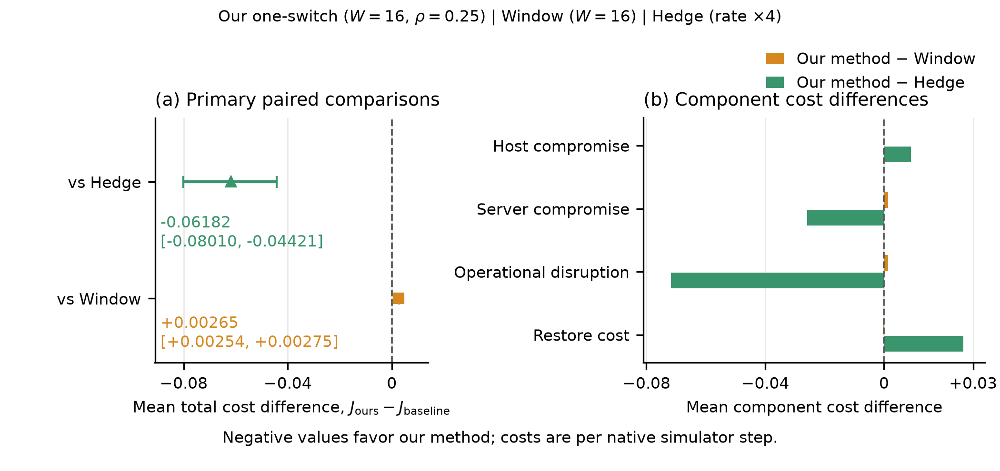
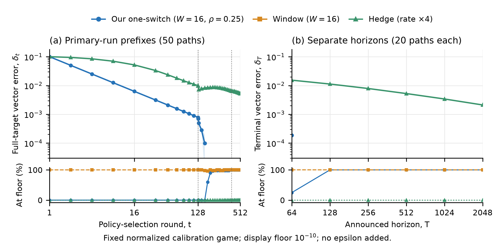
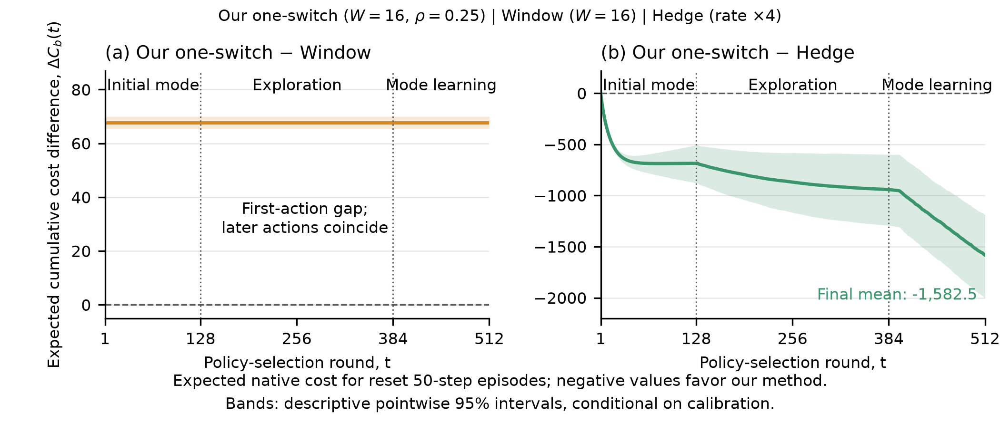

[Русский](README.ru.md) | [Full English gallery](../figures/README.md)

# English figure exports for an AAMAS manuscript

These two-column figures use unchanged public results. This is a presentation update, with no new experiments, parameter tuning, or statistical analyses. PDF exports embed fonts and PNG previews use 300 dpi. Labels use at least 8 pt at the exported 7-inch width.

## Supplementary figure: primary comparisons and explanation



[Vector PDF](primary_comparison.pdf). Panel (a) shows **our method minus each baseline** in the original sum-of-four-components native cost per simulator step. Negative values favor our method. Intervals are the original 10,000-draw paired crossed-bootstrap intervals over 400 complete held-out simulator-seed tables and 50 complete common paths, providing approximate simultaneous 95% coverage across the two prespecified contrasts, conditional on the fixed calibration and selected configurations. The positive window difference is retained. Panel (b) decomposes exactly the same differences into native components; these descriptive means carry no additional hypothesis tests or uncertainty claim.

The locked configurations are **Our one-switch (W=16, rho=0.25)**, **Window (W=16)**, and **Hedge (rate ×4)**. The overall cost differences are −0.0618179 versus Hedge and +0.00264599 versus Window. Improvement is supported versus Hedge, not versus Window. All three methods share the same exogenous attacker paths. Each policy-selection round evaluates expected mixtures of separately reset 50-step simulator episodes.

## Optional main-paper figure: calibrated vector geometry



[Vector PDF](calibrated_geometry.pdf). This is the **absolute Euclidean distance to the full realized-hull response target**, using the frozen normalized training tensor. It is not a native scalar cost difference. Panel (a) retains all 50 primary paths and panel (b) retains all 20 new common paths at each of the six announced horizons. Lines are medians; translucent bands are empirical 10–90% ranges across paths, not confidence intervals. All numerical projection diagnostics remain available in the [original geometry data](../geometry/README.md).

The lower strips count values whose numerical upper distance is at or below the declared display floor 1e−10. Such values are omitted from logarithmic axes without substituting an epsilon. A band is shown only where both of its endpoints exceed the floor. At T≥128 the terminal error of our method and Window is at numerical precision on all tested paths; the decay order cannot be estimated. The target in panel (a) expands when a new opponent mode first appears, and the separate announced-horizon runs in panel (b) scale curriculum lengths and learning-rate formulas with T. The same 20 path-seed identifiers are reused across horizons; runs across horizons are not claimed to be statistically independent. This figure does not prove a convergence rate, transfer from calibration to deployment, or superiority over Window.

## Placement and captions

Use a compact primary-results table and the following cumulative difference figure in the main text. The paired-comparison/component figure is supplementary to avoid duplicating that table. Include the calibrated-geometry figure only if space permits, alongside its mathematical metric definition and numerical limitations. The existing [loss dynamics](../dynamics/loss_dynamics.pdf), [complete validation sensitivity](../dynamics/validation_sensitivity.pdf), and [path distribution](../dynamics/paired_path_distribution.pdf) are useful supplementary figures.



[Vector PDF](cumulative_cost_difference.pdf). Both panels subtract the indicated baseline from our method. The vertical axis is **expected cumulative native cost**, equal to 50 times the sum of mean per-step costs over policy-selection rounds: `Delta C_b(t) = 50 sum_s (c_s^(ours) - c_s^(b))`. Here `c_s^(m)` is instantaneous mean cost at round s; the terminal mean is `J_m = (1/T) sum_s c_s^(m)`. Bands are the existing 2,000-draw descriptive pointwise 95% crossed-bootstrap intervals; they do not replace the original simultaneous primary intervals. The three marked phases are initial mode, exploration, and mode learning against a uniform reference defense. The same exogenous paths are shared by all compared learners. The Window gap becomes constant after the initial round; its 1/t average dilution is not the convergence rate of vector error.

English LaTeX captions and plain-text accessibility descriptions are in [captions.tex](captions.tex). Each description is shorter than 2,000 characters. Figure labels, caption definitions, and the direction of subtraction must be retained when copying the artwork into a manuscript.

## Reproduction and provenance

From the repository root:

```powershell
python scripts/build_aamas_paper_figures.py --output results/runs/aamas_presentation_rebuild
```

The script reads only the original analysis and computed numerical projection arrays. It performs no bootstrap draws, simulator episodes, projections, or learner updates. `provenance.json` records all source hashes, exact estimates, captions, units, and software versions; `SHA256SUMS.json` covers the presentation files. Existing study protocols, algorithms, banks, and statistical results are unchanged.
