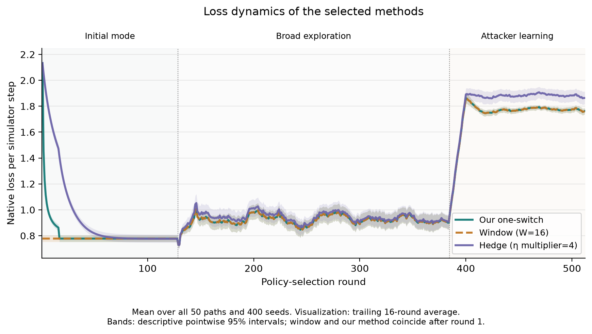
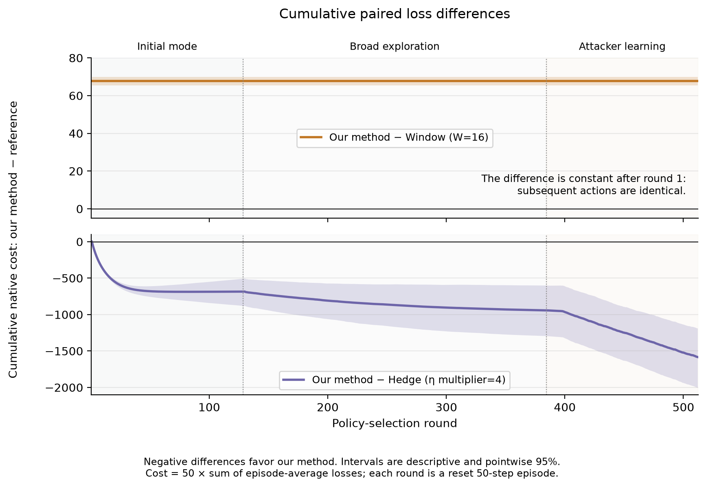
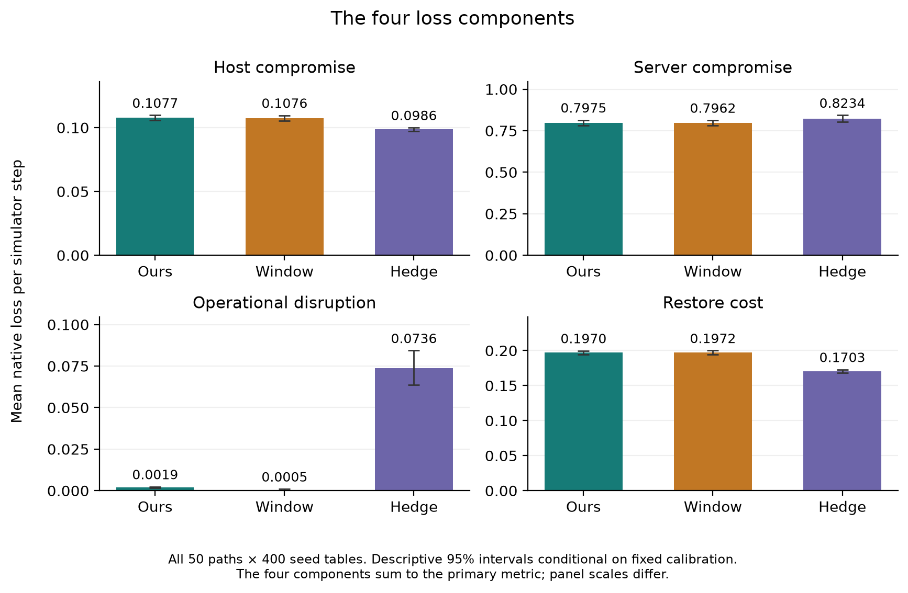
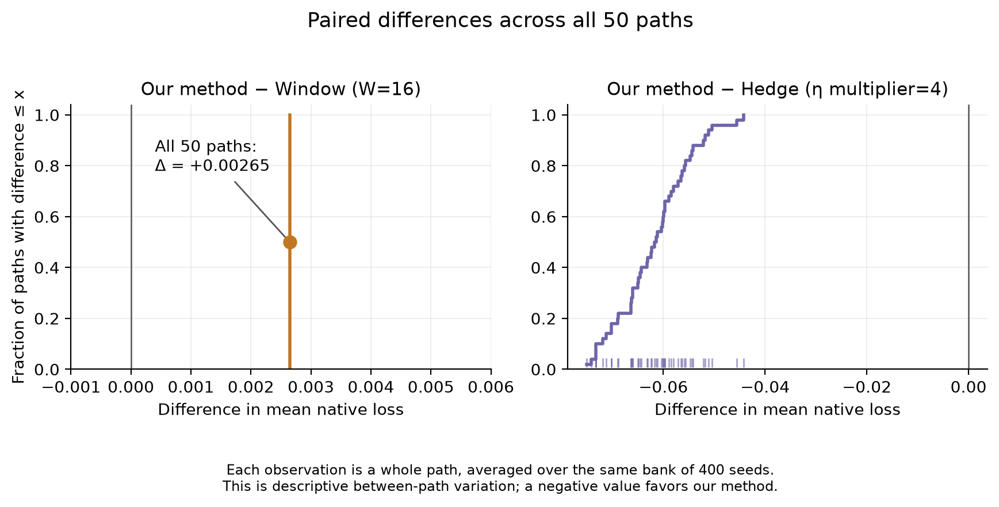
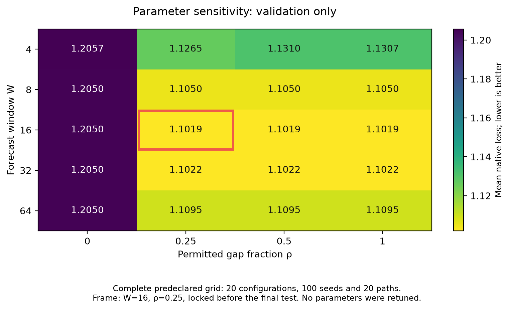
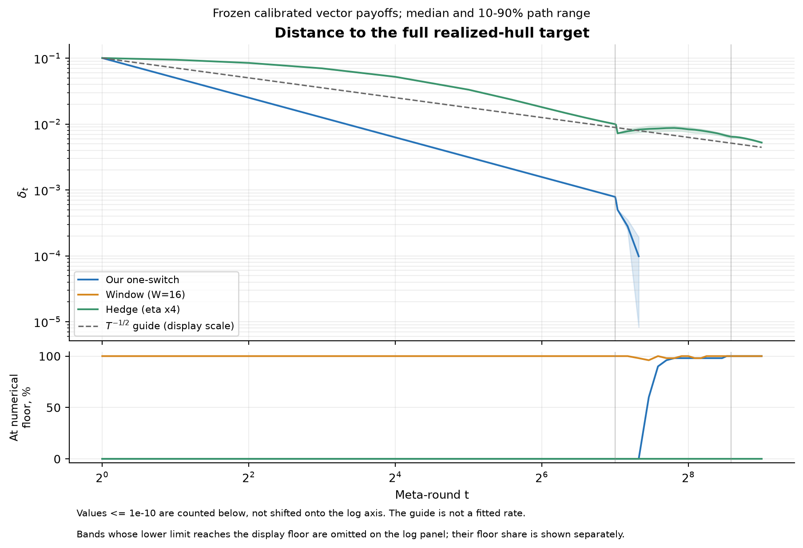
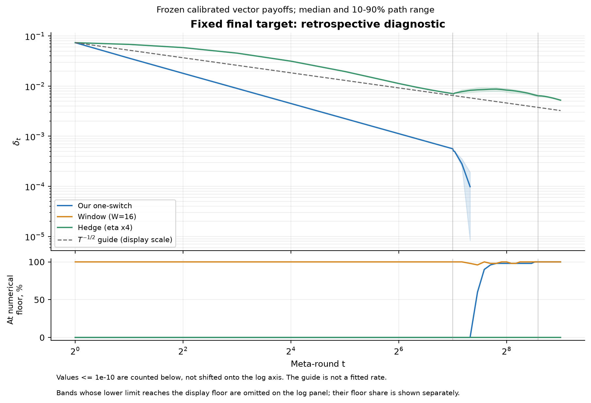
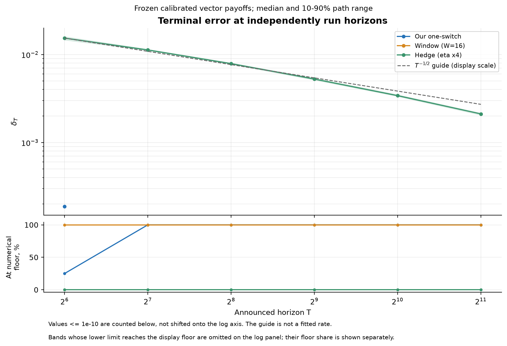

[English](README.md) | [Русский](README.ru.md) | [Primary report](../README.md)

# Figure gallery

All figures compare the three validation-selected methods: our continuous
scalar-aware one-switch (W=16, rho=0.25), window (W=16), and Hedge (multiplier 4).
The original parameters, all 50 primary paths, and both primary comparisons
are retained. These supplementary figures are descriptive additions made after
the primary study; the [figure protocol](../../../docs/cage_figures_protocol.json)
was frozen before the separate horizon sweep.

## Native losses over time

Past-16-round smoothing reveals the timing of the loss differences. Vertical
lines separate the initial known attack, broad mode mixture, and learning of
mode selection against a common reference defense. Shading gives descriptive
pointwise 95% intervals from whole simulator-table and whole-path resampling.

[PDF](../dynamics/loss_dynamics.pdf) · [Data and methodology](../dynamics/README.md)

## Cumulative paired differences

Negative values favor our method. The scale is the expected accumulated native
cost over separately reset 50-step episodes. The window difference is constant
after round one because subsequent actions match on every path. Dividing that
constant by time would produce 1/t without demonstrating a vector error rate.

[PDF](../dynamics/cumulative_differences.pdf)

## Four cost components

Host compromise, server compromise, operational disruption and restoration
cost sum to the primary scalar metric. Component differences explain the
aggregate result; the panels have different vertical scales, each starting
at zero. They are not additional confirmatory hypothesis tests.

[PDF](../dynamics/loss_components.pdf)

## All 50 paired paths

Each point averages one path over the same 400 test tables. The empirical
distribution exposes consistency and spread without treating repeated table
use as independent samples. All 50 paths favor our method over Hedge and favor
window over our method.

[PDF](../dynamics/paired_path_distribution.pdf)

## Validation sensitivity

The full 20-configuration oracle grid uses the original validation data.
The frame marks the previously selected W=16, rho=0.25; the test results
have not been used to change this choice.

[PDF](../dynamics/validation_sensitivity.pdf)

## Full-target vector error and horizons

The error is measured in the normalized training game against the full target
generated by the realized opponent hull, including interior mixtures and
response regions. It differs from held-out native simulator cost. The target
expands when a new mode appears, so a drop can reflect target expansion.

The fixed final target is a retrospective diagnostic used only for evaluation.
It helps separate movement of the average payoff from expansion of the target.

These are separate runs at six announced horizons, using all 20 new common
path seeds at each horizon and the original selected settings. Curriculum
lengths and learning-rate formulas scale with the horizon. Median and 10–90%
path ranges are conditional on the fixed training game. Values at numerical
precision are counted separately rather than replaced with positive constants
for a logarithmic fit. Ranges whose lower quantile reaches the display floor
are omitted from the log panel; the lower panel retains the floor-case counts.
A T^(-1/2) guide is not a proof of an empirical decay order.

[Prefix PDF](../geometry/prefix_error.pdf) ·
[Fixed-target PDF](../geometry/prefix_fixed_target.pdf) ·
[Horizon PDF](../geometry/horizon_error.pdf) ·
[Data, numerical diagnostics and reproduction](../geometry/README.md)

## For the paper

A compact main-text selection is loss dynamics, cumulative paired differences,
and vector error; the component panels explain the operational meaning of the
losses. Path distributions, validation sensitivity and fixed-target diagnostics
can go into supplementary material if space is limited. English PDF exports
preserve vector graphics. The manuscript has not been edited.
