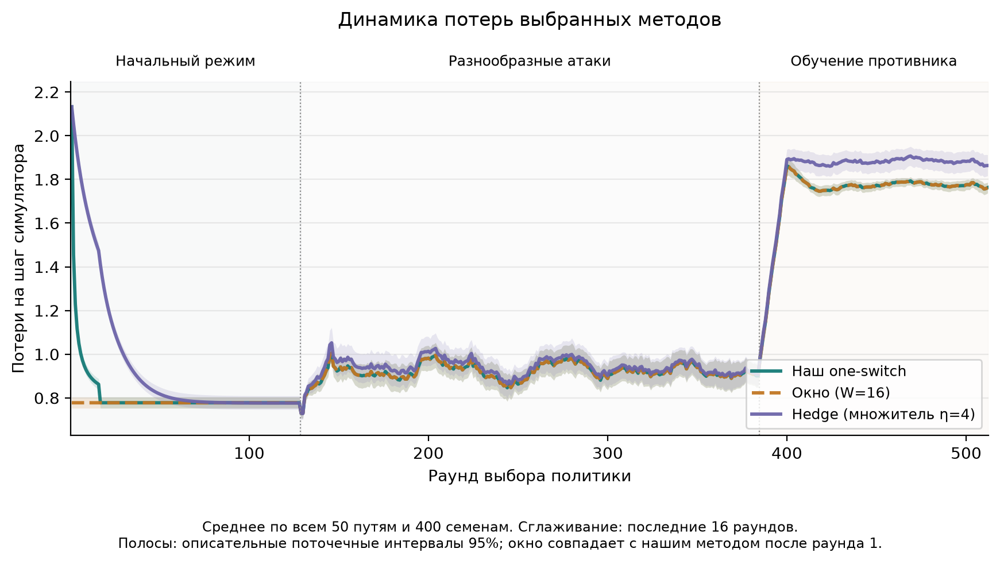
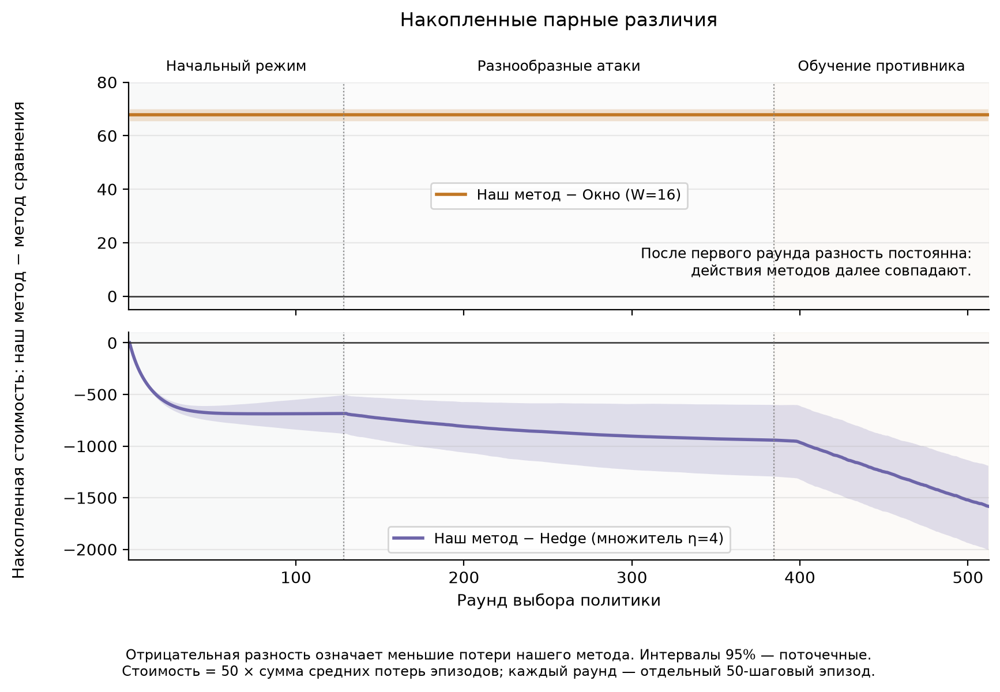
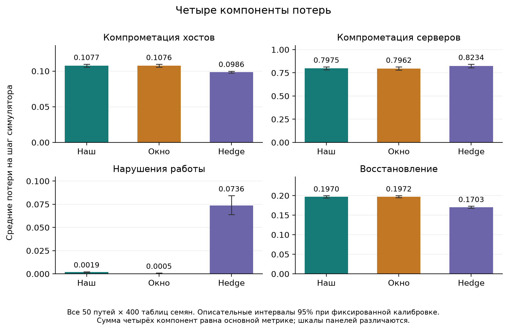
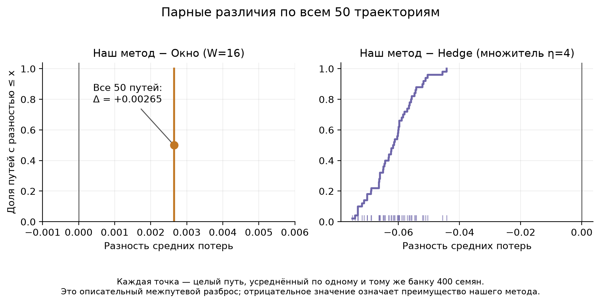
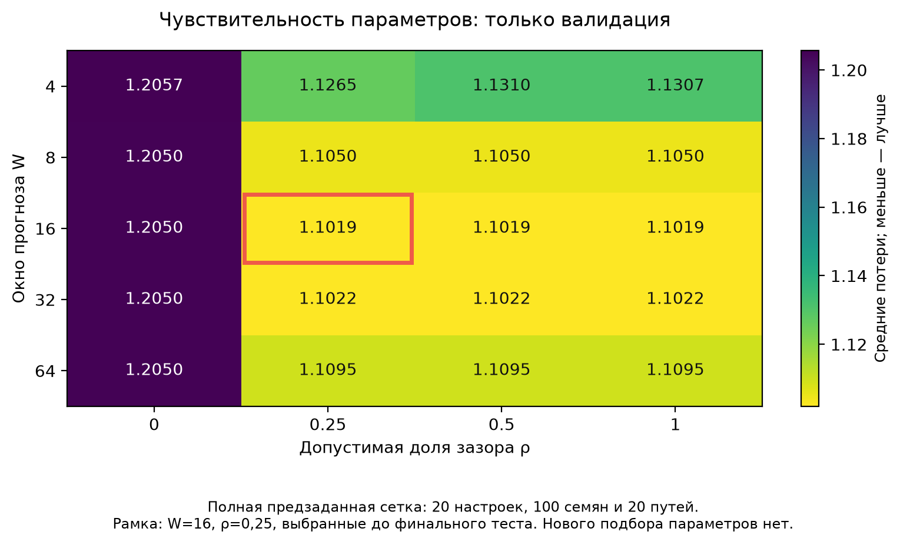
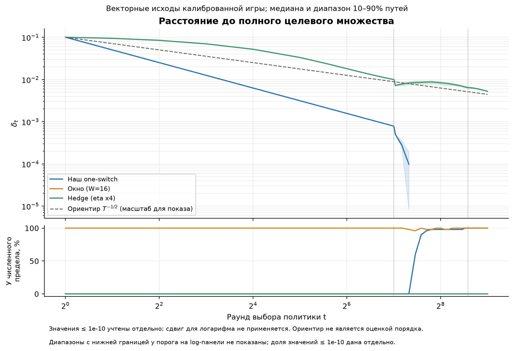
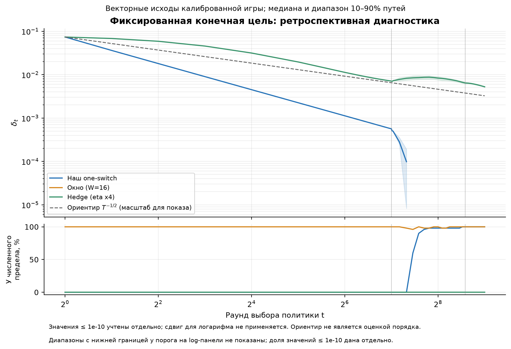
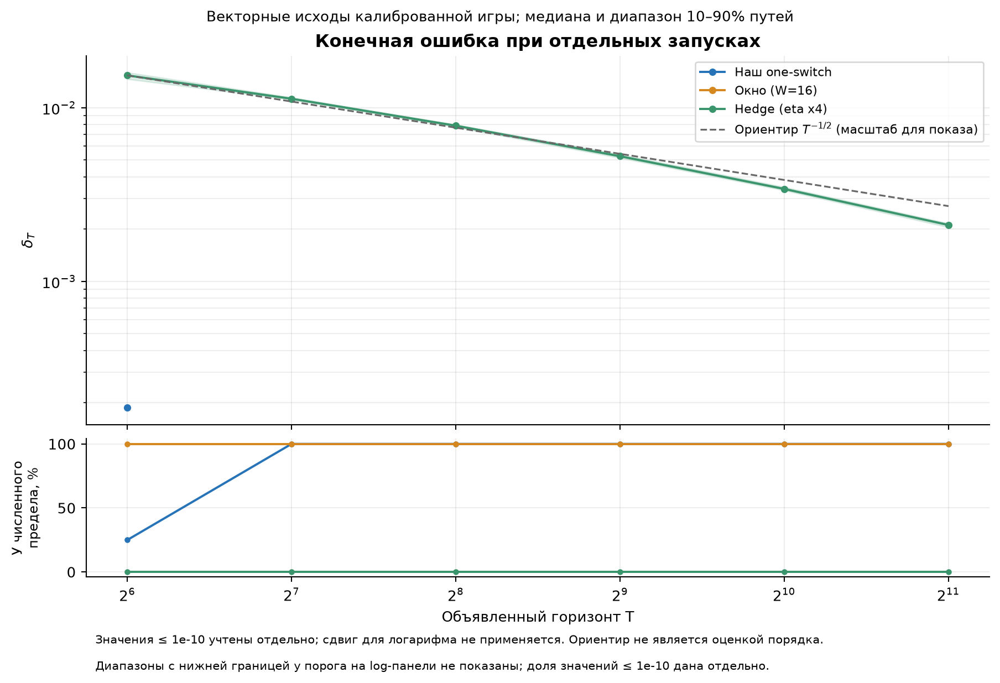

[English](README.md) | [Русский](README.ru.md) | [Основной отчёт](../README.ru.md)

# Галерея графиков

[Английский набор для AAMAS](../aamas/README.ru.md) содержит три компактных
рисунка с направлением «наш метод минус метод сравнения», единицами стоимости
и раздельными определениями неопределённости. [Раздел LaTeX](../../../paper/README.ru.md)
предлагает таблицу и накопленную разницу для основного текста; компоненты и
геометрия отнесены к дополнению. [Рекомендации AAMAS](../../../docs/aamas_submission_ru.md)
фиксируют официальные требования 2027 года и правила анонимного пакета.

Все графики сравнивают три выбранных на валидации метода: наш непрерывный
one-switch со скалярным прогнозом (W=16, rho=0,25), окно (W=16) и Hedge
(множитель 4). Сохранены параметры, все 50 основных путей и оба основных
сравнения. Эти дополнительные графики описательные и построены после основного
исследования; [протокол графиков](../../../docs/cage_figures_protocol.json)
зафиксирован до отдельной серии запусков на разных горизонтах.

## Динамика штатных потерь

Сглаживание по последним 16 раундам показывает, когда возникает разница между
методами. Вертикальные линии разделяют начальную известную атаку, широкую смесь
режимов и обучение выбора режимов против общей опорной защиты. Полосы —
описательные поточечные интервалы 95% с пересэмплированием целых таблиц
симулятора и целых путей.

[PDF](../dynamics/loss_dynamics.ru.pdf) · [Данные и методика](../dynamics/README.ru.md)

## Накопленные парные разности

Отрицательные значения означают меньшие потери нашего метода. Шкала показывает
ожидаемую накопленную стоимость отдельных 50-шаговых эпизодов с перезапуском.
Разность с окном постоянна после первого раунда: последующие действия совпадают
на каждом пути. Деление этой константы на время даст 1/t, не устанавливая
скорость убывания векторной ошибки.

[PDF](../dynamics/cumulative_differences.ru.pdf)

## Четыре компоненты стоимости

Компрометация хостов, компрометация серверов, нарушения работы и восстановление
в сумме дают основной скалярный показатель. Разности компонент объясняют общий
результат; шкалы панелей различаются, каждая начинается от нуля. Дополнительные
подтверждающие проверки гипотез по компонентам не проводились.

[PDF](../dynamics/loss_components.ru.pdf)

## Все 50 парных путей

Каждая точка усредняет один путь по тем же 400 тестовым таблицам. Эмпирическое
распределение показывает устойчивость результата и разброс, сохраняя зависимость
при повторном использовании таблиц. На всех 50 путях наш метод лучше Hedge,
а окно лучше нашего метода.

[PDF](../dynamics/paired_path_distribution.ru.pdf)

## Чувствительность на валидации

Полная сетка из 20 настроек оракула использует исходные валидационные данные.
Рамка отмечает ранее выбранные W=16, rho=0,25; финальные результаты не
использовались для изменения выбора.

[PDF](../dynamics/validation_sensitivity.ru.pdf)

## Векторная ошибка относительно полной цели и горизонты

Ошибка измеряется в нормированной обучающей игре до полной цели, порождённой
реализованной оболочкой противника, включая внутренние смеси и области ответов.
Это другой показатель, чем штатные потери на отложенных эпизодах симулятора.
При появлении нового режима цель расширяется, что тоже может снижать расстояние.

Фиксированная конечная цель — ретроспективная диагностика только для оценки.
Она помогает отделить движение среднего исхода от расширения цели.

Это отдельные запуски на шести объявленных горизонтах, по 20 новых общих семян
пути на каждом, с исходными выбранными настройками. Длины фаз и формулы скорости
обучения масштабируются с горизонтом. Медиана и диапазон 10–90% путей условны
относительно фиксированной обучающей игры. Значения у численного предела
учитываются отдельно; положительные константы для логарифмической подгонки
не добавляются. Диапазоны, нижний квантиль которых достигает порога отображения,
на логарифмической панели не показаны; нижняя панель сохраняет долю таких
значений. Ориентир T^(-1/2) не доказывает эмпирический порядок убывания.

[PDF префиксов](../geometry/prefix_error.ru.pdf) ·
[PDF фиксированной цели](../geometry/prefix_fixed_target.ru.pdf) ·
[PDF горизонтов](../geometry/horizon_error.ru.pdf) ·
[Данные, численные диагностики и воспроизведение](../geometry/README.ru.md)

## Для статьи

Компактный набор для основного текста: динамика потерь, накопленные парные
разности и векторная ошибка; компонентные панели поясняют прикладной смысл
потерь. Распределения путей, чувствительность и диагностику фиксированной цели
можно вынести в дополнительные материалы при нехватке места. Английские PDF
сохраняют векторную графику. Рукопись не редактировалась.
