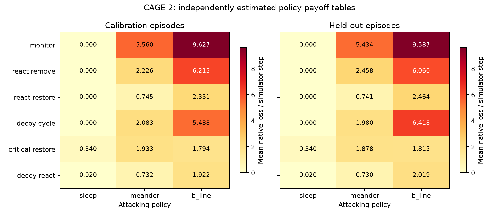
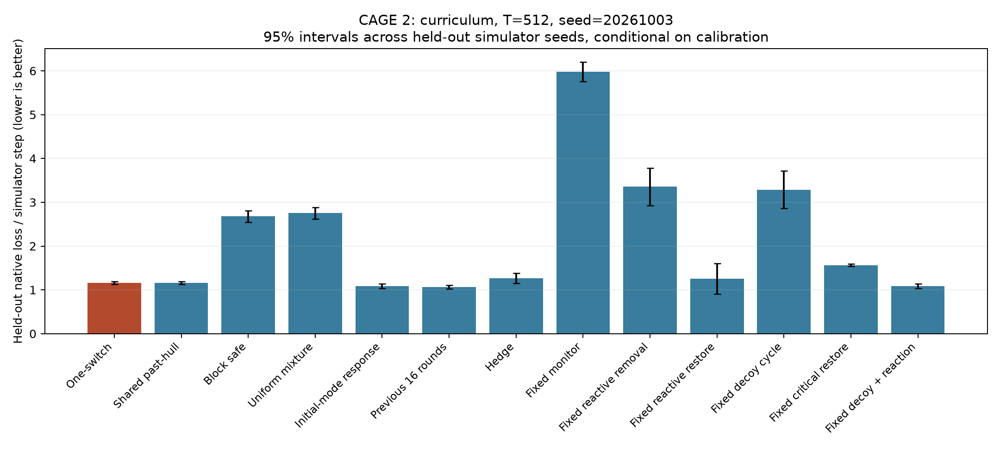

[English](README.md) | [Русский](README.ru.md)

# CAGE 2: результаты первого опыта

Выполнено 1440 эпизодов официального симулятора по 50 шагов: 40 калибровочных и 40 проверочных seed для каждой из 18 пар политик. На зафиксированной калиброванной игре проведено девять сравнений: три сценария, три seed атакующего, 512 раундов и 13 методов.

**Средняя штатная потеря CAGE за шаг; меньше лучше.** Значения усреднены по трём заданным траекториям атакующего.

| Метод | Постоянный Meander | Смена режимов | Интерактивный атакующий |
|---|---:|---:|---:|
| Наш метод | 0.7354 | 1.2020 | 1.2018 |
| Общий метод past-hull | 0.7354 | 1.2020 | 1.2018 |
| Безопасная процедура | 2.1666 | 2.7651 | 2.7651 |
| Равномерная смесь | 2.2033 | 2.8459 | 2.8459 |
| Ответ на начальный режим | 0.7296 | 1.1245 | 1.1237 |
| Ответ по последним 16 атакам | 0.7296 | 1.0994 | 1.0989 |
| Hedge | 0.8604 | 1.3072 | 1.3064 |
| Фиксированное наблюдение | 5.4344 | 6.1615 | 6.1615 |
| Фиксированное удаление | 2.4577 | 3.4792 | 3.4792 |
| Фиксированное восстановление | 0.7406 | 1.3046 | 1.3046 |
| Фиксированные приманки | 1.9796 | 3.4195 | 3.4195 |
| Восстановление важных серверов | 1.8781 | 1.5862 | 1.5959 |
| Приманки с реакцией | 0.7296 | 1.1245 | 1.1237 |

Компоненты потерь в общем сценарии смены режимов:

| Метод | Ущерб безопасности | Восстановление | Сумма |
|---|---:|---:|---:|
| Наш метод | 0.9525 | 0.2495 | 1.2020 |
| Безопасная процедура | 2.6349 | 0.1302 | 2.7651 |
| Hedge | 1.1231 | 0.1841 | 1.3072 |
| Ответ по последним 16 атакам | 0.9009 | 0.1984 | 1.0994 |

## Интерпретация

Наш метод заметно лучше консервативной безопасной процедуры на этом меню политик. Его средняя потеря также ниже Hedge, однако для меняющихся сценариев условный 95% интервал парной разности с Hedge включает ноль. При смене атак ущерб безопасности ниже Hedge, но затраты на восстановление выше. Ответ по последним 16 атакам и хорошая фиксированная политика дают меньшую среднюю суммарную потерю, чем наш метод. Эксперимент не устанавливает общего превосходства.

Переключений не было; действия `one_switch` совпадают с `shared_past_hull` с точностью вычислений с плавающей точкой. При трёх чистых режимах новизна возникает только при первом появлении двух оставшихся режимов. Накопленная невязка ограничена 4, тогда как порог для K=6 и T=512 равен примерно 1444. Это опыт быстрой адаптации, без подтверждения преимущества механизма переключения.

Проверочные потери получены из независимого банка эпизодов после фиксации решений игроков. Разница между калибровочной игрой и проверочным банком сохраняется. Доверительные интервалы используют 40 seed как парные блоки по всей таблице; три траектории атакующего не превращают их в 120 независимых наблюдений. Интервалы условны на калибровку и эти траектории, не включают её неопределённость и не корректируются для множества сравнений.

В интерактивном сценарии методы встречают разные траектории при одном и том же правиле атакующего. Расстояния до собственных реализованных целей и regret по собственной траектории следует читать с этой оговоркой. Общий сценарий смены режимов даёт прямое сравнение на одинаковом пути.

Это выбор между фиксированными политиками по известной оценённой модели с раскрытием режима атаки после решения. Внутри эпизода защиты используют частичные наблюдения. Новые тактики нападения не обучаются; опыт не воспроизводит исторические атаки на действующую сеть.

## Файлы и воспроизведение

[Методология и команды](../../docs/cage_ru.md).

- [Все девять сравнений](all_run_summaries.json)
- [Агрегаты, компоненты потерь и парные интервалы](aggregate.json)
- [Банк эпизодов и происхождение](../../data/cage2/provenance.json)

