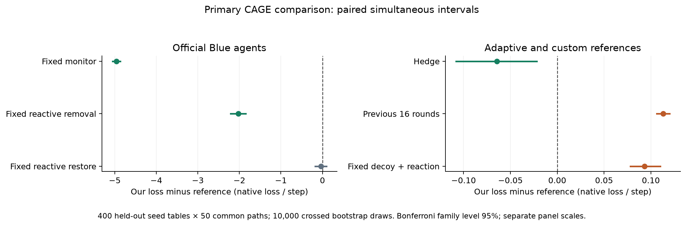
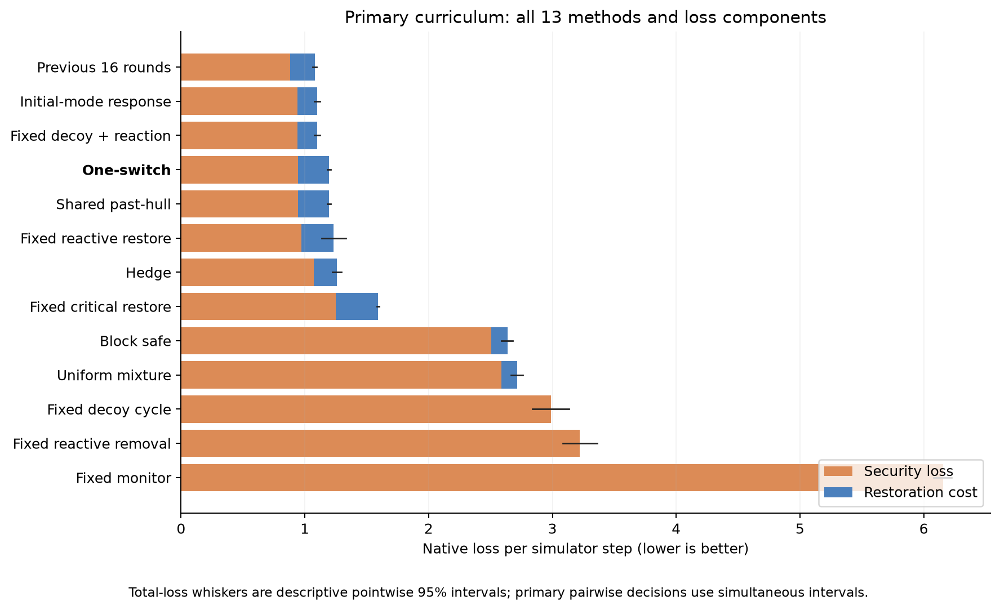
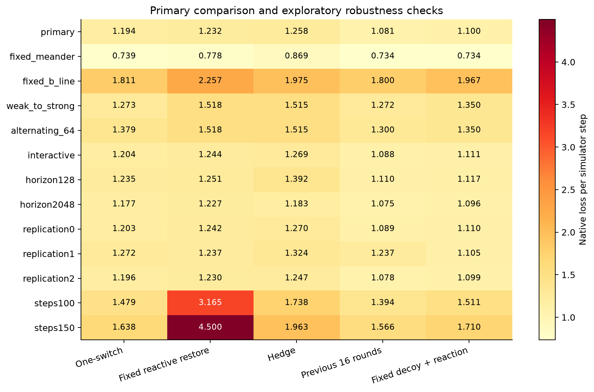

[English](README.md) | [Русский](README.ru.md)

# Extended CAGE 2 study

The pre-specified primary decision supports lower loss in 3 comparisons, higher loss in 2, and leaves 1 inconclusive. Decisions use simultaneous bootstrap intervals across six comparisons, conditional on the original calibration.

This extends the pilot study in the official CAGE 2 simulator. Primary analysis uses 400 new simulator seeds and 50 common attack paths. Episodes contain 50 steps. The primary endpoint is the sum of four native loss components per step; lower is better. The defense menu, weights, calibration, and switch budget are unchanged.

## Primary results

| Method | Native total loss | Host compromise | Server compromise | Disruption | Restore |
|---|---:|---:|---:|---:|---:|
| `one_switch` | 1.19373 | 0.11612 | 0.82366 | 0.00303 | 0.25092 |
| `shared_past_hull` | 1.19373 | 0.11612 | 0.82366 | 0.00303 | 0.25092 |
| `block_safe` | 2.63599 | 0.12896 | 1.08192 | 1.29507 | 0.13004 |
| `uniform` | 2.71442 | 0.12918 | 1.09390 | 1.36503 | 0.12631 |
| `historical_best` | 1.10039 | 0.10466 | 0.83781 | 0.00000 | 0.15792 |
| `last_window` | 1.08057 | 0.10595 | 0.77514 | 0.00020 | 0.19928 |
| `hedge` | 1.25799 | 0.10095 | 0.76445 | 0.20922 | 0.18337 |
| `fixed_monitor` | 6.15407 | 0.14279 | 1.78339 | 4.22789 | 0.00000 |
| `fixed_react_remove` | 3.22231 | 0.14608 | 1.13088 | 1.94535 | 0.00000 |
| `fixed_react_restore` | 1.23157 | 0.07028 | 0.38246 | 0.51889 | 0.25994 |
| `fixed_decoy_cycle` | 2.98744 | 0.15474 | 1.33465 | 1.49805 | 0.00000 |
| `fixed_critical_restore` | 1.59073 | 0.15652 | 1.09421 | 0.00000 | 0.34000 |
| `fixed_decoy_react` | 1.10039 | 0.10466 | 0.83781 | 0.00000 | 0.15792 |

| Our method minus reference | Difference and simultaneous interval | Holm p | Decision |
|---|---:|---:|---|
| `fixed_monitor` | -4.96034 [-5.05224, -4.86426] | 0.0005999 | lower loss |
| `fixed_react_remove` | -2.02858 [-2.21210, -1.84508] | 0.0005999 | lower loss |
| `fixed_react_restore` | -0.03784 [-0.17642, 0.09388] | 0.4504 | inconclusive |
| `fixed_decoy_react` | 0.09334 [0.07809, 0.10992] | 0.0005999 | higher loss |
| `hedge` | -0.06425 [-0.10811, -0.02170] | 0.0005999 | lower loss |
| `last_window` | 0.11317 [0.10638, 0.12013] | 0.0005999 | higher loss |

A negative difference means lower loss for our method. Intervals use 10,000 shared resampling draws and per-comparison error 0.05/6. Holm p-values are additional approximate inference; primary decisions follow the interval rule fixed before the new runs.

`fixed_monitor`, `fixed_react_remove`, and `fixed_react_restore` are unchanged official policies. `fixed_decoy_react` is this repository's predeclared heuristic. Hedge and `last_window` receive the same information and weights. Other pure policies appear above but are outside the primary comparison family.

## Sensitivities and secondary scenarios

The following 95% intervals are descriptive and do not add primary advantage claims. Columns show `one_switch` minus the named reference.

| Group | `fixed_monitor` | `fixed_react_remove` | `fixed_react_restore` | `fixed_decoy_react` | `hedge` | `last_window` |
|---|---:|---:|---:|---:|---:|---:|
| `fixed_meander` | -4.76561 [-4.90371, -4.61869] | -1.37932 [-1.54302, -1.22180] | -0.03890 [-0.10755, 0.02329] | 0.00550 [0.00532, 0.00568] | -0.12946 [-0.16113, -0.10045] | 0.00550 [0.00532, 0.00568] |
| `fixed_b_line` | -7.75339 [-7.79355, -7.71143] | -4.00786 [-4.30652, -3.70858] | -0.44681 [-0.69859, -0.20741] | -0.15669 [-0.19858, -0.11268] | -0.16396 [-0.18968, -0.13824] | 0.01053 [0.01015, 0.01091] |
| `weak_to_strong` | -6.26169 [-6.33613, -6.18397] | -2.69578 [-2.86773, -2.52554] | -0.24504 [-0.37063, -0.12531] | -0.07778 [-0.09866, -0.05586] | -0.24202 [-0.28128, -0.20331] | 0.00093 [-0.00023, 0.00214] |
| `alternating_64` | -6.15555 [-6.22952, -6.07776] | -2.58964 [-2.76202, -2.41942] | -0.13891 [-0.26301, -0.01884] | 0.02835 [0.01185, 0.04561] | -0.13643 [-0.17050, -0.10322] | 0.07853 [0.07652, 0.08054] |
| `interactive` | -5.00752 [-5.08493, -4.92769] | -2.05076 [-2.19532, -1.90940] | -0.04013 [-0.14062, 0.05736] | 0.09288 [0.08096, 0.10548] | -0.06514 [-0.09780, -0.03285] | 0.11546 [0.10995, 0.12109] |
| `horizon128` | -5.00041 [-5.07645, -4.92234] | -2.03640 [-2.18230, -1.89148] | -0.01553 [-0.12043, 0.08437] | 0.11826 [0.09621, 0.13942] | -0.15705 [-0.19933, -0.11627] | 0.12545 [0.10613, 0.14516] |
| `horizon2048` | -4.95465 [-5.02222, -4.88397] | -2.03241 [-2.17109, -1.89336] | -0.04969 [-0.14886, 0.04598] | 0.08082 [0.06842, 0.09368] | -0.00626 [-0.02925, 0.01673] | 0.10200 [0.09704, 0.10725] |
| `replication0` | -5.00681 [-5.07692, -4.93404] | -2.04675 [-2.18868, -1.90519] | -0.03881 [-0.13997, 0.05893] | 0.09360 [0.07954, 0.10812] | -0.06696 [-0.09337, -0.04070] | 0.11438 [0.10675, 0.12163] |
| `replication1` | -4.90164 [-5.03252, -4.76793] | -1.96466 [-2.12602, -1.80633] | 0.03455 [0.03132, 0.03782] | 0.16657 [0.06866, 0.26769] | -0.05233 [-0.07889, -0.02510] | 0.03455 [0.03132, 0.03782] |
| `replication2` | -4.95678 [-5.04166, -4.87455] | -2.02274 [-2.16548, -1.88115] | -0.03403 [-0.13310, 0.06193] | 0.09686 [0.08317, 0.11107] | -0.05090 [-0.07628, -0.02538] | 0.11801 [0.10991, 0.12593] |
| `steps100` | -7.15268 [-7.25847, -7.03816] | -5.13789 [-5.39225, -4.87222] | -1.68671 [-2.03222, -1.35279] | -0.03214 [-0.05771, -0.00540] | -0.25962 [-0.29310, -0.22654] | 0.08419 [0.07206, 0.09607] |
| `steps150` | -7.87271 [-7.96025, -7.78615] | -6.28140 [-6.48437, -6.07387] | -2.86215 [-3.23086, -2.49790] | -0.07233 [-0.09261, -0.04964] | -0.32486 [-0.34990, -0.29811] | 0.07158 [0.06295, 0.08031] |

## Interpretation limits

Actual master switch counts are 0 in the primary group and 0 across all groups. `one_switch` and `shared_past_hull` actions are numerically equal in every group at absolute tolerance 1e-14: yes. The master's extra normalization can introduce machine-precision rounding; original arrays are retained. With three pure modes, residual growth occurs only on first appearances and cannot reach the original switch threshold. This study evaluates fast-policy adaptation and does not demonstrate safe switching.

The 400 simulator seeds and 50 paths are two crossed sets of sampling units. Their 20,000 combinations are not 20,000 independent episodes. Each bootstrap draw retains a whole seed table and whole path, including method pairing. Primary intervals exclude calibration uncertainty; three new fits provide descriptive robustness checks.

In the interactive group, the same causal attacker rule runs separately against each defense, inducing different paths. Differences compare complete interactions, not responses to one common path. Fixed and deterministic groups can contain identical path repetitions; these do not create independent path variation.

In `fixed_b_line`, the initial mode is known to be B-line: `historical_best` and `last_window` start from index 2. Published `effective_initial_red_index` makes this existing rule explicit; the original `initial_red_index=1` denotes the primary scenario default. Actions and original results were not recomputed.

Learning selects among three known attacking policies; it does not learn new tactics inside them. The current attack label is revealed after defense selection, a full-information modeling assumption. Mixtures are expected outcomes of complete reset episodes. Findings concern this simulator and policy menu, rather than recorded operational attacks.

All 13 methods use the same predeclared endpoints. Primary decisions were not selected after inspecting the new held-out episodes. Security and restore differences in `aggregate.json` are descriptive and outside the six primary tests.

## Reproduction

[Frozen protocol](protocol.json), [machine-readable results](aggregate.json), [group aggregates](groups/), [methodology](../../docs/cage_study_en.md). The pilot report remains separately available under `results/cage_reference`.







```bash
python scripts/build_cage_study_report.py
python scripts/plot_cage_study.py
```

New simulator episodes: 14,400; internal steps: 1,098,000.
