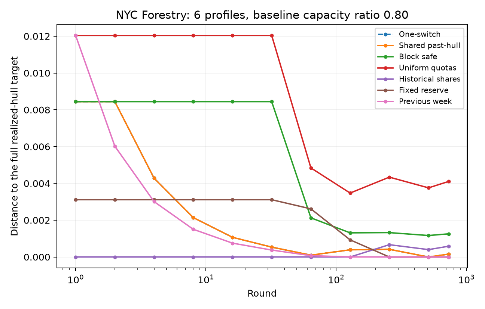
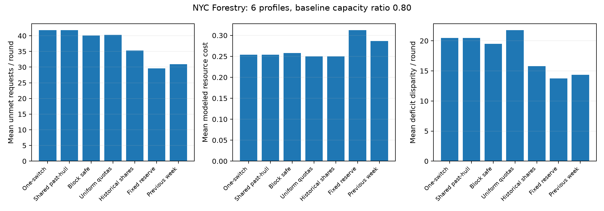
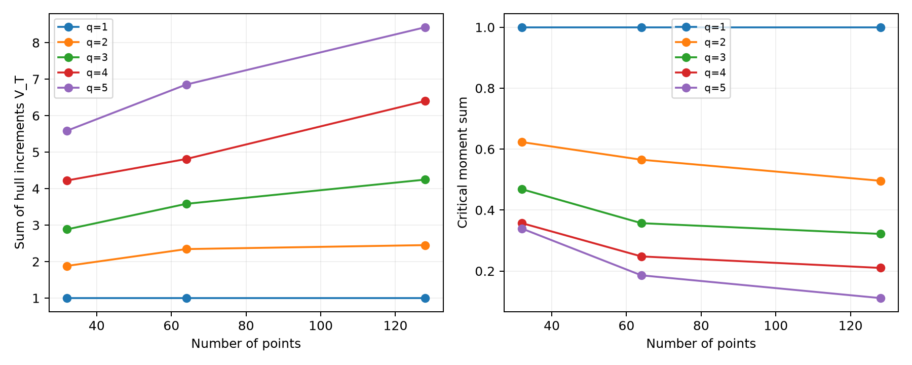

[English](README.md) | [Русский](README.ru.md) | [Home](../../README.md)

# Recorded reference run

The initial suite was completed on 2026-10-03. It contains 15 controlled
synthetic comparisons (three seeds, q=1,...,5, T=128), nine NYC comparisons
(M=3,6,12; baseline capacity ratios 0.6,0.8,1.0; T=730), and 15 geometric
checks (q=1,...,5; T=32,64,128). Each comparison contains seven policies.
Correctness tests and the numerical regressions are separate from these runs.

## NYC example: six profiles and baseline ratio 0.8

The mathematical distance uses the quantized game. The remaining columns use
original held-out counts and the stated service model. Resource cost is
dimensionless. Tiny distances below numerical resolution are approximately zero.

| Method | Target distance | Unmet requests/day | Resource cost | Deficit disparity/day |
|---|---:|---:|---:|---:|
| `one_switch` | 0.000156235 | 41.787 | 0.25423 | 20.479 |
| `shared_past_hull` | 0.000156235 | 41.787 | 0.25423 | 20.479 |
| `block_safe` | 0.00125743 | 40.108 | 0.25782 | 19.475 |
| `uniform` | 0.00410585 | 40.260 | 0.25000 | 21.763 |
| `historical_share` | 0.00058473 | 35.294 | 0.25000 | 15.789 |
| `reserve` | 2.66299e-16 | 29.593 | 0.31250 | 13.724 |
| `last_week` | 7.99668e-18 | 30.934 | 0.28656 | 14.342 |

Maximum full-target squared projection gap in this example: 3.67e-16.

The one-switch and shared past-hull methods coincide throughout the NYC suite;
the maximum action-coordinate difference is 0. The
theoretical budget cannot trigger on this horizon. The constructed switch
regression separately validates the fallback logic.

The initial results do not establish superiority over allocation heuristics.
The previous-week and fixed-reserve references are useful controls: extra
capacity can improve service independently of adaptation. Target distance,
unmet demand, resource cost, and disparity measure different objectives.
The comparisons are exploratory results for the stated model.

## Quantization sensitivity

| Profiles M | Realized q | Relative L2 RMS | Relative total L1 |
|---:|---:|---:|---:|
| 3 | 2 | 48.11% | 43.22% |
| 6 | 5 | 36.90% | 34.42% |
| 12 | 9 | 32.09% | 27.97% |

The approximation error remains substantial. Dimension is a property of the
finite profile representation; this run does not establish low dimension in
the original demand trace. Target sets and normalization differ between profile
libraries, so cross-M target distances do not isolate a dimensional effect.

## Synthetic and geometric checks

The [synthetic summary](synthetic_summary.json) preserves all seeds and policies.
Regimes are introduced explicitly and then mixed, making adaptation visible.
Near-zero target distance in some runs can reflect the growing target set;
these paths do not estimate worst-case convergence exponents.
All 15 [critical-moment checks](geometry.json) satisfy the stated geometric bound
to the reported numerical accuracy. Finite-horizon checks complement the proof;
they do not prove the asymptotic bound or a game minimax lower bound.







## Reproduce

```bash
python -m pytest -q
python -m lowdim_games.cli synthetic --q 1 2 3 4 5 --horizon 128 --seeds 20261003 20261004 20261005 --output results/runs/synthetic --plots
python -m lowdim_games.cli geometry --q 1 2 3 4 5 --horizons 32 64 128 --output results/runs/geometry
python -m lowdim_games.cli nyc --profiles 3 6 12 --capacity-ratios 0.6 0.8 1.0 --output results/runs/nyc
python scripts/build_reference_report.py
```

The committed files include summaries, representative complete action traces,
game tensors, preprocessing arrays, and exportable PNG/PDF figures. Other
complete runs are regenerated by the commands above. Input CSV hashes and
software versions are recorded in JSON; exact installed dependencies are in
`requirements-lock.txt` at the repository root.
