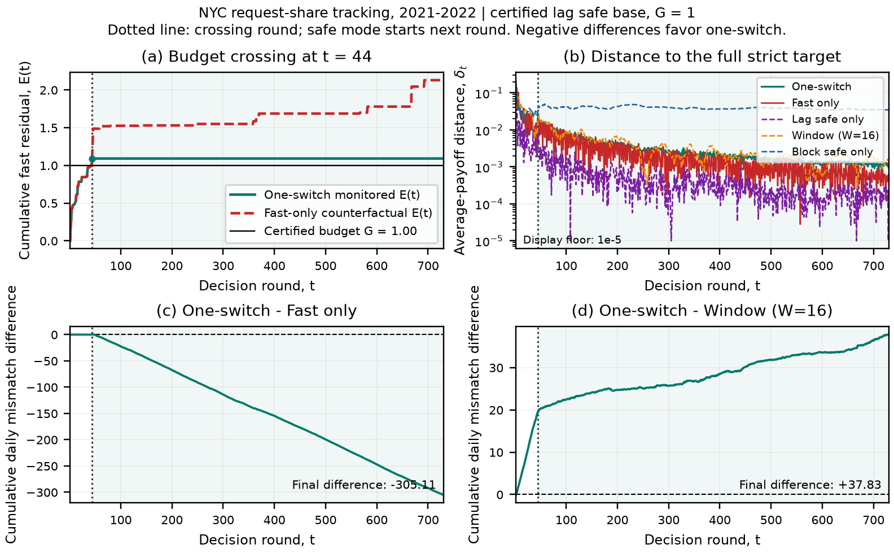
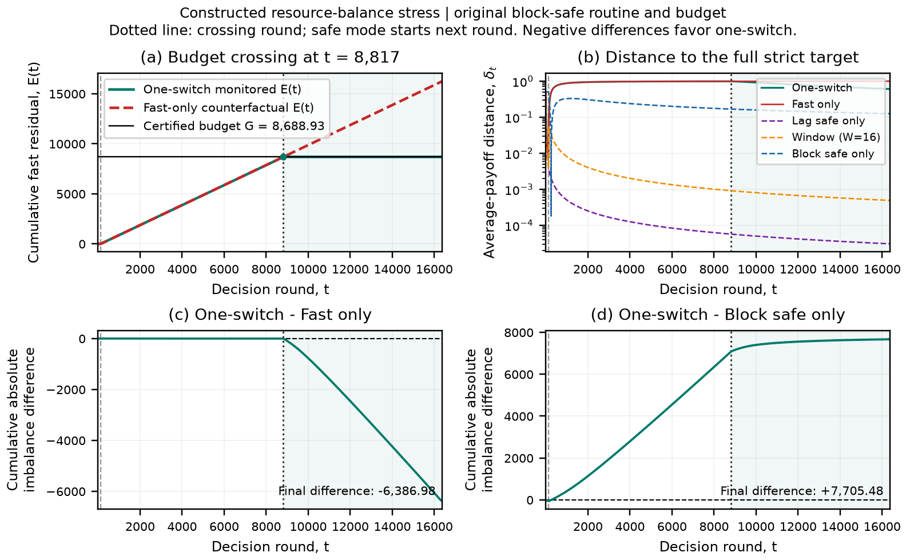

[English](README.md) | [Русский](README.ru.md) | [Главная](../../README.ru.md)

# Полные результаты переключения

Это описательные исследовательские дополнения после аудита зафиксированного
CAGE. Они показывают пересекающий ход и весь безопасный хвост. Параметры по
этим результатам не выбираются; для фиксированных рядов не заявляются
доверительные интервалы, p-value или подтверждающая выборка. Сохранены все
пять методов, включая более сильные стратегии. Таблицы округлены;
[analysis.json](analysis.json) содержит полные сохранённые числа.

## NYC: последовательный ряд 2021–2022

730 суточных агрегатов заявок Hazard задают доли Brooklyn, Queens и остальных
трёх районов. Один день без заявок представлен равномерными долями. Это
зарегистрированные заявки, а не потребность в сотрудниках или измеренные
результаты обслуживания. [Происхождение данных](../../data/switching_nyc/provenance.json)
содержит официальный набор, запрос агрегации и исходные хеши CSV.
Обучения профилей и квантования здесь нет.

Игра: `P=L=Delta_3`, `u(p,ell)=(p-ell)/sqrt(2)`, эталон `p*(ell)=ell`.
**Полная** строгая цель равна `{0}`, включая ответы на ненаблюдавшиеся смеси
в оболочке. Все методы выбирают действие до текущего наблюдения и начинают
равномерно. Внутри основного запуска перезапусков нет.

Master использует отдельную лаговую безопасную процедуру: первый ход свежего
запуска равномерный, далее используются предыдущие доли. Точное равенство
`sum u=(p_initial-ell_last)/sqrt(2)` даёт консервативный сертификат
`B0(0)=0`, `B0(h)=1` при `h>0`, поэтому **G=1** известен до игры. Это другая
безопасная процедура, а не подобранный порог исходного блочного алгоритма.

Метрики различаются:

- `delta_t = ||(1/t) sum_s u_s||_2`: расстояние среднего вектора до цели.
- Средняя суточная норма: `(1/T) sum_t ||u_t||_2`.
- Средняя L1-ошибка долей: `(1/T) sum_t ||p_t-ell_t||_1`, без деления на `sqrt(2)`.
- Накопленная разность норм: `sum_s (||u_s^master||_2-||u_s^baseline||_2)`.
  Отрицательные значения означают преимущество master; это не разности `delta_t`.

| Метод | Конечная δ | Средняя суточная норма | Средняя L1-ошибка долей |
|---|---:|---:|---:|
| One-switch | 0,000939885298 | 0,155910247468 | 0,346483011179 |
| Только быстрый режим | 0,000644365043 | 0,573865013191 | 1,309584310923 |
| Только безопасный lag | 0,000167400025 | 0,131152905539 | 0,289748910998 |
| Окно, W=16 | 0,001311085014 | 0,104084213940 | 0,230298469800 |
| Только блочная процедура | 0,034672804800 | 0,109093125205 | 0,242108870049 |

Пересечение происходит на **44-м раунде**, **2021-02-13**:
`E_43=0,992324057295`, `E_44=1,090736034998`. Раунд 44 остаётся быстрым;
свежий lag начинает раунд 45 и работает **686 раундов**. E master сохраняет
значение в момент перехода. Пунктир — отдельный fast-only, который заканчивается
при `E=2,129676313323`. До пересечения включительно действия двух методов
совпадают. Численная поправка проекций около `1,33e-7` существенно меньше
запасов до порога; ошибка телескопирования префиксов хвоста менее `5,2e-16`.

Конечные накопленные разности суточных норм: **−305,106978978** относительно
быстрого метода и **+37,833004475** относительно окна. Суточная ошибка master
меньше, чем у fast, но конечное векторное расстояние у fast ниже. Lag лучше
по конечной δ, окно — по суточной ошибке. Ошибки разных знаков могут
компенсироваться в среднем векторе.



[Векторный PDF](figures/switching_nyc_dynamics.pdf). Пунктир обозначает
пересечение; safe начинается следующим ходом. Панель (b) отображает значения
ниже `1e-5` на явно указанном нижнем уровне: затронуты четыре точки lag,
исходные массивы сохранены. Остальные панели показывают E и накопленные
разности суточных норм. Доверительных полос нет.

Годовые проверки — отдельные свежие запуски, а не перезапуски по блокам
внутри 730-дневного ряда. Master пересекает порог на раунде **44** в 2021
и **26** в 2022 году, во втором случае `E_26=1,001078750041`:

| Год | Метод | Конечная δ | Средняя суточная норма |
|---|---|---:|---:|
| 2021 | One-switch | 0,001437149006 | 0,180284970600 |
| 2021 | Только быстрый режим | 0,000787605164 | 0,568608734052 |
| 2021 | Только безопасный lag | 0,000643846251 | 0,130770286743 |
| 2021 | Окно, W=16 | 0,001487341298 | 0,106465936245 |
| 2021 | Только блочная процедура | 0,032315630757 | 0,108895989674 |
| 2022 | One-switch | 0,000991389611 | 0,155649632210 |
| 2022 | Только быстрый режим | 0,002138496664 | 0,567110706230 |
| 2022 | Только безопасный lag | 0,000334800051 | 0,130959985497 |
| 2022 | Окно, W=16 | 0,000332890973 | 0,101496707311 |
| 2022 | Только блочная процедура | 0,044824485958 | 0,112273125354 |

## Исходный блочный бюджет: искусственный тест

Мощность `p in [0,1]`; множество противника `conv{0,e_1,...,e_M}` задано
в исходном евклидовом пространстве. Спрос `r=sum(ell)`, выплата `u=p-r`,
эталон `p*=r`; полная цель снова `{0}`. Объявленный горизонт **16384**:
128 ходов нулевого спроса, далее новый ортогональный тип с единичным спросом
на каждом ходу. Реализованная размерность **16256**. Метки эквивалентны по выплатам.

Master сохраняет исходную блочную реализацию и
**G=6 T^(3/4)=8688,928127220297**. Новый ортогональный тип проецируется в ноль;
быстрые операции используют точные аналитические уравнения этой геометрии.
Только safe использует точное сжатие выплат `(1-r,r)`.

Здесь δ равна `abs(mean(p-r))`, средний абсолютный дисбаланс — `mean(abs(p-r))`,
средняя мощность — `mean(p)`. Накопленные разности абсолютного дисбаланса
суммируют ошибки каждого хода в направлении master минус метод сравнения.

| Метод | Конечная δ | Средний абсолютный дисбаланс | Средняя мощность |
|---|---:|---:|---:|
| One-switch | 0,602296147684 | 0,602418217996 | 0,389891352316 |
| Только быстрый режим | 0,992126464844 | 0,992248535156 | 0,000061035156 |
| Только блочная процедура | 0,124300406158 | 0,132112906158 | 0,867887093842 |
| Только безопасный lag | 0,000030517578 | 0,000091552734 | 0,992156982422 |
| Окно, W=16 | 0,000488281250 | 0,000549316406 | 0,991699218750 |

Пересечение происходит на **8817-м раунде**, при `E_8816=8688`, `E_8817=8689`.
Свежий безопасный хвост начинается на раунде 8818 и содержит **7567 раундов**.
Его суммарная выплата `−1180,020083653083` укладывается в бюджет
`4867,926932557328`. Сумма быстрого префикса `−8688`, итоговая сумма
`−9868,020083653070`.

Конечные накопленные разности абсолютного дисбаланса равны **−6386,979916347**
относительно fast и **+7705,482229165** относительно отдельного block-safe.
Lag и окно сильнее и здесь. Искусственный тест показывает пользу относительно
продолжения fast, но не общее превосходство, обучение реальным атакам,
скорости для малой размерности или эмпирический результат при q=4.



[Векторный PDF](figures/switching_original_budget.pdf). Показаны все пять
расстояний. Нижние панели сравнивают накопленный абсолютный дисбаланс с fast
и отдельным block-safe, без интервалов или заявлений о статистической значимости.

## Воспроизведение и проверка

[Протокол](protocol.json), [анализ](analysis.json) и [хеши результатов](manifest.json)
сохраняют параметры, версии, источники и результаты. Массивы каждого хода:
[полный NYC](nyc_2021_2022/one_switch.npz), [2021](nyc_2021/one_switch.npz),
[2022](nyc_2022/one_switch.npz) и [тест исходного бюджета](original_budget_stress/one_switch.npz).
В каждом каталоге сохранены четыре метода сравнения и сводка. Полный E fast
продолжен после переключения master. Нулевые residual safe служат заполнителями;
для отслеживаемых остатков используйте маску fast.

```bash
python -m pip install -e ".[test]"
python -m pytest -q
python scripts/run_switching_study.py
```

Достаточно базовых зависимостей; `--output results/runs/switching_replay`
создаёт отдельный повторный запуск. В полной среде разработки **пройдены 152
теста**. Независимые проверки массивов подтверждают первое пересечение,
быстрый префикс, новые безопасные часы, остановку E, аналитические расстояния,
восстановление метрик и хеши. Проверки оракулов с плавающей точкой являются
численным свидетельством; равенства цели и бюджета доказаны аналитически.
См. [методику](../../docs/switching_ru.md), [интеграцию AAMAS](../../paper/README.ru.md)
и [зафиксированное сравнение CAGE](../cage_adaptation/README.ru.md).
